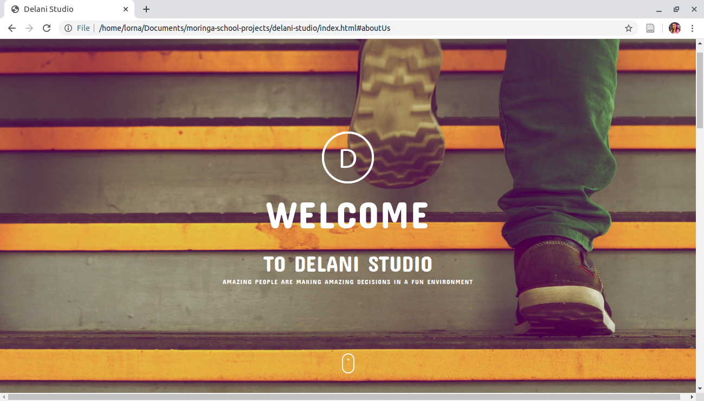

# DELANI STUDIO
#### A landing page for Delani Studio, 8th April 2020
#### By **Lorna Kamau**
## Description
This is a landing page for Delani studio. Users visiting the page are able to know more about Delani Studio, the services they offer, view their portfolio and also contact them.

## Development
To make advancements/modifications, follow these steps:

- Fork the repository
- Create a new branch (`git checkout -b improve-feature`)
- Make the appropriate changes in the files
- Add changes made
- Commit your changes (`git commit -am 'Improve feature'`)
- Push to the branch (`git push origin improve-feature`)
- Create a Pull Request 

## Setup/Use requirements
- Visit the website at https://lornakamau.github.io/delani-studio/
- Click on the What We Do icons to view a short description of the services we offer
- Reach out to us by sending us an email

## Technologies Used
This project is written in HTML5, CSS, Bootstrap, jQuery and JavaScript.

## Support and contact details
Should you be unable to access my web application, have any recommendations or questions, feel free to email me; kamaulorna@gmail.com.

## To-do
1. Validation of email addresses entered

## [License](https://github.com/lornakamau/delani-studio/blob/master/LICENSE.md)
MIT (c) 2020 [Lorna Kamau](https://github.com/lornakamau)